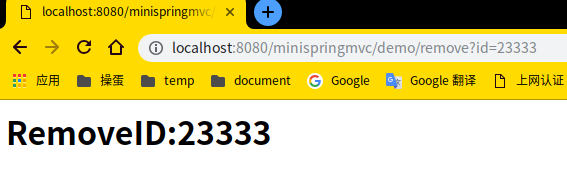

# Study-MiniSpringMvc
学习SpringMvc，手写乞丐版springmvc

### SpringMVC的执行流程

1. 当用户发送请求，被前端控制器（DispatcherServlet）捕获-----捕获请求
2. 前端控制器进行解析，得到URL，通过URL调用HandlerMapping并获得该Handler配置的所有相关对象----查找Handler
3. 前端控制器根据得到的Handler,选择合适的HandlerAdapter,提取Request中的模型数据,填入Handler入参,开始执行Handler,最后返回一个ModelAndView对象.(执行Handler) 
4. 前端控制器根据返回的ModelAndViewm,选择合适的ViewResolver(选择ViewResolver) 
5. 通过ViewResolver结合Model和View来渲染视图,前端控制器将渲染结果返回给客户端(渲染并返回)

### 运行条件

1. Tomcat版本‘8.5.45’，jdk8.

### 实现注解列表

* @MyAutowired

* @MyController

* @MyRequestMapping

* @MyRequestParam

* @MyService

### 设计思路

#### 1、读取配置

​	从图中可以看出，SpringMVC本质上是一个Servlet,这个 Servlet 继承自 HttpServlet。FrameworkServlet负责初始化SpringMVC的容器，并将Spring容器设置为父容器。因为本文只是实现SpringMVC，对于Spring容器不做过多讲解。

​    为了读取web.xml中的配置，我们用到ServletConfig这个类，它代表当前Servlet在web.xml中的配置信息。通过web.xml中加载我们自己写的MyDispatcherServlet和读取配置文件。

####     2、初始化阶段

​    在前面我们提到DispatcherServlet的initStrategies方法会初始化9大组件，但是这里将实现一些SpringMVC的最基本的组件而不是全部，按顺序包括：

- 加载配置文件
- 扫描用户配置包下面所有的类
- 拿到扫描到的类，通过反射机制，实例化。并且放到ioc容器中(Map的键值对 beanName-bean) beanName默认是首字母小写
- 初始化HandlerMapping，这里其实就是把url和method对应起来放在一个k-v的Map中,在运行阶段取出

####     3、运行阶段

​    每一次请求将会调用doGet或doPost方法，所以统一运行阶段都放在doDispatch方法里处理，它会根据url请求去HandlerMapping中匹配到对应的Method，然后利用反射机制调用Controller中的url对应的方法，并得到结果返回。按顺序包括以下功能：

- 异常的拦截
- 获取请求传入的参数并处理参数
- 通过初始化好的handlerMapping中拿出url对应的方法名，反射调用

### 运行结果

```http
http://localhost:8080/minispringmvc/demo/add?a=10&b=20
```


```http
http://localhost:8080/minispringmvc/demo/query?name=world
```


```http
http://localhost:8080/minispringmvc/demo/remove?id=23333
```



